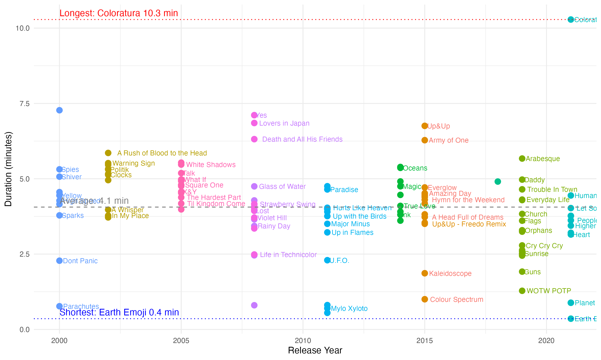
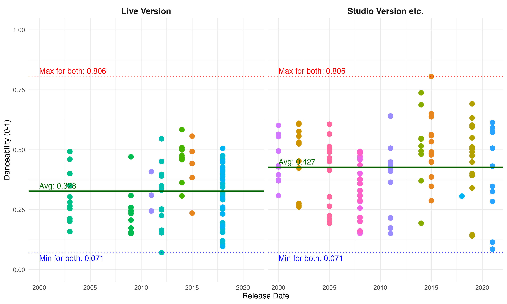
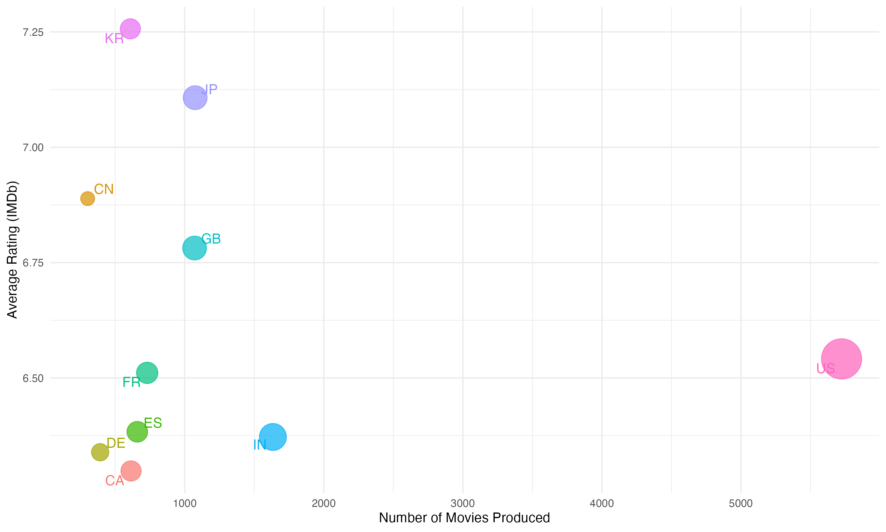

```{r setup, include=FALSE}
knitr::opts_chunk$set(echo = FALSE, message = FALSE, warning = FALSE, fig.width = 6, fig.height = 5, fig.pos="H", fig.pos = 'H')


if(!require("tidyverse")) install.packages("tidyverse")
library(tidyverse)
```


<!-- ############################## -->
<!-- # Start Writing here: -->
<!-- ############################## -->

# Introduction \label{Introduction}

This README file sets out the main outputs (with some descriptions) of my answers to the questions. I lay out each question in the same way, starting with pulling the data into this file for the respective questions. Thereafter, I reproduce my plots and tables created for each question with a short description thereof in relation to the question. All functions that are responsible for the data wrangling and plots are saved in the respective code folders in each question, as well as having duplicates saved in the code folder of the root directory (i.e. for the main project).

# Source functions

The following code sources all of the functions used in the paper. I have made copies from all of my individual code folders inside of each of my questions and pasted it into the code folder in my root so as to make it easier to call from this README file.

```{r Source all functions, echo=TRUE}
list.files('code/', full.names = T, recursive = T) %>%
    .[grepl('.R', .)] %>% 
    as.list() %>% 
    walk(~source(.))
```


# Question 1: Baby names

## Source data and load necessary packages

The following code details how I sourced my data for Question 1.

```{r echo=TRUE}
Baby_Names <- read_rds("./data/US_Baby_names/Baby_Names_By_US_State.rds")
Top100Billboard <- read_rds("./data/US_Baby_names/charts.rds")
HBO_titles <- read_rds("./data/US_Baby_names/HBO_titles.rds")
HBO_credits <- read_rds("./data/US_Baby_names/HBO_credits.rds")
```

## Short description of method

In Question 1 I aimed to answer the question of how baby names persisted over time, amongst other things. The following plot helped me to explain the Spearman rank correlation in the relationship. Unfortunately, due to time constraints I only managed to produce this plot for this question.

## Plot 1: Spearman rank correlations

This plot visualises the Spearman Rank Correlations and their trends over time. This shows that for both boys and girls, the top 25 baby names each year experienced many shifts in persistence over time. Looking at the post-1990s, we also see a large drop in persistence around the year 2000.

```{r, out.width="80%", fig.align="center", fig.cap="Plot showing Spearman rank correlations for baby names and the persistence of their names over time \\label{Fig1}"}

```

# Question 2: Coldplay vs Metallica

## Source data and load necessary packages 

The following code details how I sourced my data for Question 2.


```{r Source data and packages Q2, echo=TRUE}
# load packages
pacman::p_load(brms)

# source data
coldplay <- read_csv("./data/Coldplay_vs_Metallica/Coldplay.csv")
metallica <- read_csv("./data/Coldplay_vs_Metallica/metallica.csv")
spotify <- read_rds("./data/Coldplay_vs_Metallica/Broader_Spotify_Info.rds")
billboard_100 <- read_rds("./data/Coldplay_vs_Metallica/charts.rds")
```


## Short description of method

In this question I ventured to come up with an analysis on the trends over time of the well-known bands Coldplay and Metallica. A comparative analysis of advanced scatter plots was used to compare their albums over time around themes such as song duration (excluding live recordings), and danceability (how suited a song is for dancing) of songs recorded during live and non-live (studio, demo, remastered etc.) performances. 

## Plot 1: Song duration for Metallica

This plot showed how the average song duration for Metallica changed over the band's career thus far. The average, longest and shortest song durations were also included in the plot.

```{r, out.width="80%", fig.align="center", fig.cap="Plot showing Metallica song durations over time \\label{Fig1}"}
knitr::include_graphics("./Question_2/output/fig1.png")
```

## Plot 2: Song duration for Coldplay

The next plot showed the same information but for Coldplay this time. We note here that Coldplay on average had shorter track durations than Metallica.

```{r, out.width="80%", fig.align="center", fig.cap="Plot showing Coldplay song durations over time \\label{Fig2}"}

```

## Plot 3:  Danceability of Coldplay live vs non-live

This next plot worked to compare how Coldplay get their fans moving in both the live, and studio and other non-live performances.

```{r, out.width="80%", fig.align="center", fig.cap="Plot showing Coldplay danceability difference between different recording types \\label{Fig3}"}

```

## Plot 4: Danceability of Metallica live vs non-live

This plot performed the same analysis as the previous one, except now for Metallica. We find that on average for both bands, the non-live performances had higher danceability scores than the live performances. This contradicts literature and my thinking that live performances are rife for more vibrant music.

```{r, out.width="80%", fig.align="center", fig.cap="Plot showing Metallica danceability difference between different recording types  \\label{Fig4}"}
knitr::include_graphics("./Question_2/output/fig4.png")
```

What was also noted was that, on average, Coldplay produce more danceable music than Metallica.

# Question 3: Netflix

## Source data and load necessary packages

Herein lies the code for sourcing the data for this question.

```{r Source data Q3, echo=TRUE}
Titles <- read_rds("./data/netflix/titles.rds")
Credits <- read_rds("./data/netflix/credits.rds")
Movie_Info <- read_csv("./data/netflix/netflix_movies.csv")
```


## Short description of method

Question 3 saw us investigate what genres of movie/television are popular in different regions of the world. It included analyses of the most highly-rated genres across all countries, as well as a look at which countries produce the most movies/television and who produces the most highly-rated media.

## Plot 1: Genres and IMDB ratings

This plot created density ridges which detailed the spread of IMDB ratings across the various genres of movies and television, averaged across all countries available in the data.

```{r, out.width="80%", fig.align="center", fig.cap="Density ridges of Netflix genres and their IMDB ratings \\label{Fig1}"}
knitr::include_graphics("./Question_3/output/fig1.png")
```

## Plot 2: Top 10 movie producing countries

The second plot from Question 3 endeavoured to find the top 10 movie producing countries in terms of the frequency of movies produced.

```{r, out.width="80%", fig.align="center", fig.cap="Top 10 Movie Producing Countries \\label{Fig2}"}
knitr::include_graphics("./Question_3/output/fig2.png")
```

## Plot 3: Movie quality vs quantity for the top 10 movie producing countries

This plot showcased not only the quantity produced by the top 10 movie makers, but also the subjective quality (according to their average IMDB ratings). We see that even though the United States produces the most movies, South Korea arguably produces the best of them.

```{r, out.width="80%", fig.align="center", fig.cap="Movie quantity vs quality by country for top 10 producers \\label{Fig3}"}

```

# Question 4: Billionaires

## Source data and packages

Here is the code with which I sourced the data and functions for Question 4. (Note here: I was unable to get my `bespoke_function` to work. I have included the error I ran into in its script file)

```{r Q4 data and packages, echo=TRUE}
billionaires <- read_csv("./data/Billions/billionaires.csv")
```

## Short description of method

In Question 4, I evaluated the validity of two statements made. The claims read as follows:  
1. There is a difference in the make-up of the sources of wealth for billionaires between those from the United States (US) and those from outside of the US. More specifically, those from outside of the US have a higher proportion of billionaires who made their wealth from inheritance than those who did not.  
2. Most new self-made millionaires are in the software sector, which differs from what is was in the 90s where it was mostly consumer sectors. Moreover, richer countries generally provide more innovation in consumer services, hence less billionaires in the software sector.

## Plot 1: Billionaire inheritance in the US

This pie chart showed how proportions of those billionaires who made their wealth through inheritance changed over time in the US.

```{r, out.width="80%", fig.align="center", fig.cap="Pie chart showing proportions of US billionaires that had inherited vs those that did not inherit their wealth \\label{Fig1}"}
knitr::include_graphics("./Question_4/output/fig1.png")
```

## Table 1: US inheritance statistics

This table accompanied the above plot to help provide some analysis on the US billionaire sources of wealth make-up.

```{r Q4 Table 1: US inheritance table}
US_billion <- US_billion_extract("United States")
US_inherited_prop <- inherited_proportion(US_billion)

# I include the above code in order to generate the table
simple_inheritance_table(US_inherited_prop, caption = "Table showing the US inheritance statistics \\label{tab1}", format = "simple")
```

## Plot 2: Outside US billionaire inheritance

This chart asked the same question as the first plot, but now addressed to those billionaires from outside of the US.

```{r, out.width="80%", fig.align="center", fig.cap="Pie chart showing proportions of those outside of the US billionaires that had inherited vs those that did not inherit their wealth \\label{Fig2}"}
knitr::include_graphics("./Question_4/output/fig2.png")
```

## Table 2: Outside US billionaire inheritance statistics

This table laid out additional statistics which helped to complete the analysis comparing billionaires from the US and those from elsewhere.

```{r Outside US inheritance table}
outsideUS_billion <- outsideUS_billion_extract()
outsideUS_inherited_prop <- inherited_proportion(outsideUS_billion)

# the above code is needed to generate this table
simple_inheritance_table(outsideUS_inherited_prop, caption = "Table showing Outside of the US inheritance statistics \\label{tab2}", format = "simple")
```

All these plots and figures illustrated that the first claim made was found to be invalid. Inline calculations also showed that the growth rate of those billionaires from outside of the US who had made their wealth from sources other than inheritance was much higher in recent years than that of the US billionaires in the same scenario.

## Plot 3: Sector analysis

This plot provided a sectoral analysis which aimed to address the second claim made in the question.

```{r, out.width="80%", fig.align="center", fig.cap="Column plots showing the top 10 billionaire sectors over the 3 periods, using the number of software billionaires as a benchmark in each \\label{Fig3}"}
knitr::include_graphics("./Question_4/output/fig3.png")
```

Looking at this column plot we can see that the software sector lags behind other sectors in recent times in terms of the number of billionaires in this industry.

## Table 3: Sector analysis and GDP

The below table also strengthened the argument that there was not a strong claim to be made that software billionaires make up a large portion of the new billionaires.

```{r Q4 Table 3: Software and GDP}
linear_reg_software_gdp(billionaires, caption = "Table showing results of regression of log of GDP on the probability of being in the software sector \\label{tab3}", format = "simple")
```


# Question 5: Health

## Source data and functions

```{r Q5 data and functions, echo=TRUE}
# read in data
Health <- "./data/Health/HealthCare.csv" %>% 
    read_csv()
```

## Short description of method

In this question I attempted to provide insights into the important relationship which variables such as sleep and exercise had on measures of health, such as stress levels and weight changes. Through various plots I was able to come up with the following analyses.

## Plot 1: Sleep vs exercise as a determinant of stress

This heatmap showed that sleep is arguably more important than exercise when it comes to stress levels. When sleep is poor, regardless of exercise level, then stress is generally higher. The same was not able to be said for when activity levels are low.

```{r, out.width="80%", fig.align="center", fig.cap="Heatmap showing the relationship between sleep and exercise on stress"}
plot_stress_exercise_sleep(Health)
```

## Plot 2: Sleep and weight fluctuations

This boxplot set out the changes in weight against changes in sleep quality. It shows once again that sleep is very important in helping to stabilise weight fluctuations.

```{r, out.width="80%", fig.align="center", fig.cap="Boxplot showing the relationship between sleep quality and weight change \\label{fig2}"}
plot_weight_sleep(Health)
```

## Plot 3: Exercise and calorie balance

When looking at activity levels and their potential relationship with the calorie balance (i.e. was the calories consumed for the day above or below the recommended amount), we see that increased activity can lead to an increase in the surplus of calories consumed. This shows that while exercise is good, diet is also important and should be considered carefully when maintaining a very active lifestyle as it requires more fuel for the body.

```{r, out.width="80%", fig.align="center", fig.cap="Bubble plot showing the relationship between activity levels and calorie balance \\label{fig3}"}
plot_calorie_exercise(Health)
```

<!-- Make title of bibliography here: -->
<!-- \newpage -->


<!-- <div id="refs"></div> -->


