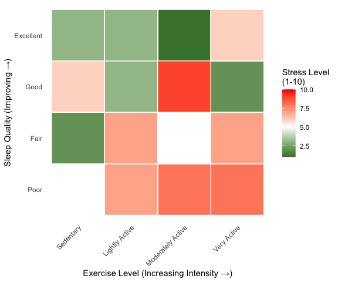

Data Science Exam:
================

<!-- ############################## -->

<!-- # Start Writing here: -->

<!-- ############################## -->

# Introduction 

This README file sets out the main outputs (with some descriptions) of
my answers to the questions. I lay out each question in the same way,
starting with pulling the data into this file for the respective
questions. Thereafter, I reproduce my plots and tables created for each
question with a short description thereof in relation to the question.
All functions that are responsible for the data wrangling and plots are
saved in the respective code folders in each question, as well as having
duplicates saved in the code folder of the root directory (i.e. for the
main project).

# Source functions

The following code sources all of the functions used in the paper. I
have made copies from all of my individual code folders inside of each
of my questions and pasted it into the code folder in my root so as to
make it easier to call from this README file.

``` r
list.files('code/', full.names = T, recursive = T) %>%
    .[grepl('.R', .)] %>% 
    as.list() %>% 
    walk(~source(.))
```

# Question 1

## Source data and load necessary packages

The following code details how I sourced my data for question 1

``` r
Baby_Names <- read_rds("./data/US_Baby_names/Baby_Names_By_US_State.rds")
Top100Billboard <- read_rds("./data/US_Baby_names/charts.rds")
HBO_titles <- read_rds("./data/US_Baby_names/HBO_titles.rds")
HBO_credits <- read_rds("./data/US_Baby_names/HBO_credits.rds")
```

## Plot 1

# Question 2

## Source data and functions

<div class="figure" style="text-align: center">


<p class="caption">

Plot showing Metallica danceability difference between different
recording types
</p>

</div>

# Question 3

## Source data and functions

## Results

# Question 4

## Source data and functions

## Results

# Question 5

## Source data and functions

## Results

<div class="figure" style="text-align: center">


<p class="caption">

Heatmap showing the relationship between sleep and exercise on stress
</p>

</div>

<!-- Make title of bibliography here: -->

<!-- \newpage -->

<!-- <div id="refs"></div> -->
