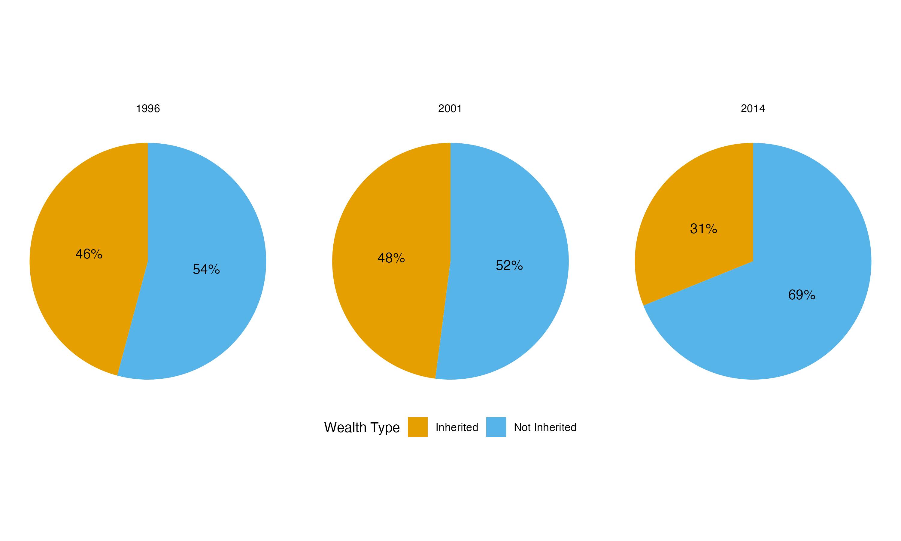

Data Science Exam:
================

<!-- ############################## -->

<!-- # Start Writing here: -->

<!-- ############################## -->

# Introduction 

This README file sets out the main outputs (with some descriptions) of
my answers to the questions. I lay out each question in the same way,
starting with pulling the data into this file for the respective
questions. Thereafter, I reproduce my plots and tables created for each
question with a short description thereof in relation to the question.
All functions that are responsible for the data wrangling and plots are
saved in the respective code folders in each question, as well as having
duplicates saved in the code folder of the root directory (i.e. for the
main project).

# Source functions

The following code sources all of the functions used in the paper. I
have made copies from all of my individual code folders inside of each
of my questions and pasted it into the code folder in my root so as to
make it easier to call from this README file.

``` r
list.files('code/', full.names = T, recursive = T) %>%
    .[grepl('.R', .)] %>% 
    as.list() %>% 
    walk(~source(.))
```

# Question 1: Baby names

## Source data and load necessary packages

The following code details how I sourced my data for Question 1.

``` r
Baby_Names <- read_rds("./data/US_Baby_names/Baby_Names_By_US_State.rds")
Top100Billboard <- read_rds("./data/US_Baby_names/charts.rds")
HBO_titles <- read_rds("./data/US_Baby_names/HBO_titles.rds")
HBO_credits <- read_rds("./data/US_Baby_names/HBO_credits.rds")
```

## Short description of method

In Question 1 I aimed to answer the question of how baby names persisted
over time, amongst other things. The following plots created help to
explain my thought process in answering such a question.

## Plot 1

# Question 2: Coldplay vs Metallica

## Source data and load necessary packages

The following code details how I sourced my data for Question 2.

``` r
# load packages
pacman::p_load(brms)

# source data
coldplay <- read_csv("./data/Coldplay_vs_Metallica/Coldplay.csv")
metallica <- read_csv("./data/Coldplay_vs_Metallica/metallica.csv")
spotify <- read_rds("./data/Coldplay_vs_Metallica/Broader_Spotify_Info.rds")
billboard_100 <- read_rds("./data/Coldplay_vs_Metallica/charts.rds")
```

## Short description of method

In this question I ventured to come up with an analysis on the trends
over time of the well-known bands Coldplay and Metallica. A comparative
analysis of advanced scatter plots was used to compare their albums over
time around themes such as song duration (excluding live recordings),
and danceability (how suited a song is for dancing) of songs recorded
during live and non-live (studio, demo, remastered etc.) performances.

## Plot 1: Song duration for Metallica

This plot showed how the average song duration for Metallica changed
over the band’s career thus far. The average, longest and shortest song
durations were also included in the plot.

<div class="figure" style="text-align: center">


<p class="caption">

Plot showing Metallica song durations over time
</p>

</div>

## Plot 2: Song duration for Coldplay

The next plot showed the same information but for Coldplay this time. We
note here that Coldplay on average had shorter track durations than
Metallica.

<div class="figure" style="text-align: center">


<p class="caption">

Plot showing Coldplay song durations over time
</p>

</div>

## Plot 3: Danceability of Coldplay live vs non-live

This next plot worked to compare how Coldplay get their fans moving in
both the live, and studio and other non-live performances.

<div class="figure" style="text-align: center">


<p class="caption">

Plot showing Coldplay danceability difference between different
recording types
</p>

</div>

## Plot 4: Danceability of Metallica live vs non-live

This plot performed the same analysis as the previous one, except now
for Metallica. We find that on average for both bands, the non-live
performances had higher danceability scores than the live performances.
This contradicts literature and my thinking that live performances are
rife for more vibrant music.

<div class="figure" style="text-align: center">


<p class="caption">

Plot showing Metallica danceability difference between different
recording types
</p>

</div>

What was also noted was that, on average, Coldplay produce more
danceable music than Metallica.

# Question 3: Netflix

## Source data and load necessary packages

Herein lies the code for sourcing the data for this question.

``` r
Titles <- read_rds("./data/netflix/titles.rds")
Credits <- read_rds("./data/netflix/credits.rds")
Movie_Info <- read_csv("./data/netflix/netflix_movies.csv")
```

## Short description of method

Question 3 saw us investigate what genres of movie/television are
popular in different regions of the world. It included analyses of the
most highly-rated genres across all countries, as well as a look at
which countries produce the most movies/television and who produces the
most highly-rated media.

## Plot 1: Genres and IMDB ratings

This plot created density ridges which detailed the spread of IMDB
ratings across the various genres of movies and television, averaged
across all countries available in the data.

<div class="figure" style="text-align: center">


<p class="caption">

Density ridges of Netflix genres and their IMDB ratings
</p>

</div>

## Plot 2: Top 10 movie producing countries

The second plot from Question 3 endeavoured to find the top 10 movie
producing countries in terms of the frequency of movies produced.

<div class="figure" style="text-align: center">


<p class="caption">

Top 10 Movie Producing Countries
</p>

</div>

## Plot 3: Movie quality vs quantity for the top 10 movie producing countries

This plot showcased not only the quantity produced by the top 10 movie
makers, but also the subjective quality (according to their average IMDB
ratings). We see that even though the United States produces the most
movies, South Korea arguably produces the best of them.

<div class="figure" style="text-align: center">


<p class="caption">

Movie quantity vs quality by country for top 10 producers
</p>

</div>

# Question 4: Billionaires

## Source data and packages

Here is the code with which I sourced the data and functions for
Question 4. (Note here: I was unable to get my `bespoke_function` to
work. I have included the error I ran into in its script file)

``` r
billionaires <- read_csv("./data/Billions/billionaires.csv")
```

## Short description of method

In Question 4, I evaluated the validity of two statements made. The
claims read as follows:  
1. There is a difference in the make-up of the sources of wealth for
billionaires between those from the United States (US) and those from
outside of the US. More specifically, those from outside of the US have
a higher proportion of billionaires who made their wealth from
inheritance than those who did not.  
2. Most new self-made millionaires are in the software sector, which
differs from what is was in the 90s where it was mostly consumer
sectors. Moreover, richer countries generally provide more innovation in
consumer services, hence less billionaires in the software sector.

## Plot 1: Billionaire inheritance in the US

This pie chart showed how proportions of those billionaires who made
their wealth through inheritance changed over time in the US.

<div class="figure" style="text-align: center">


<p class="caption">

Pie chart showing proportions of US billionaires that had inherited vs
those that did not inherit their wealth
</p>

</div>

## Table 1: US inheritance statistics

This table accompanied the above plot to help provide some analysis on
the US billionaire sources of wealth make-up.

| Year | No. of billionaires who inherited their wealth | No. of billionaires who have not inherited their wealth |
|:--:|:--:|:--:|
| 1996 | 69 | 66 |
| 2001 | 94 | 175 |
| 2014 | 143 | 356 |

Table showing the US inheritance statistics

## Plot 2: Outside US billionaire inheritance

This chart asked the same question as the first plot, but now addressed
to those billionaires from outside of the US.

<div class="figure" style="text-align: center">


<p class="caption">

Pie chart showing proportions of those outside of the US billionaires
that had inherited vs those that did not inherit their wealth
</p>

</div>

## Table 2: Outside US billionaire inheritance statistics

This table laid out additional statistics which helped to complete the
analysis comparing billionaires from the US and those from elsewhere.

| Year | No. of billionaires who inherited their wealth | No. of billionaires who have not inherited their wealth |
|:--:|:--:|:--:|
| 1996 | 132 | 156 |
| 2001 | 129 | 140 |
| 2014 | 359 | 795 |

Table showing Outside of the US inheritance statistics

All these plots and figures illustrated that

# Question 5

## Source data and functions

## Results

<div class="figure" style="text-align: center">


<p class="caption">

Heatmap showing the relationship between sleep and exercise on stress
</p>

</div>

<!-- Make title of bibliography here: -->

<!-- \newpage -->

<!-- <div id="refs"></div> -->
